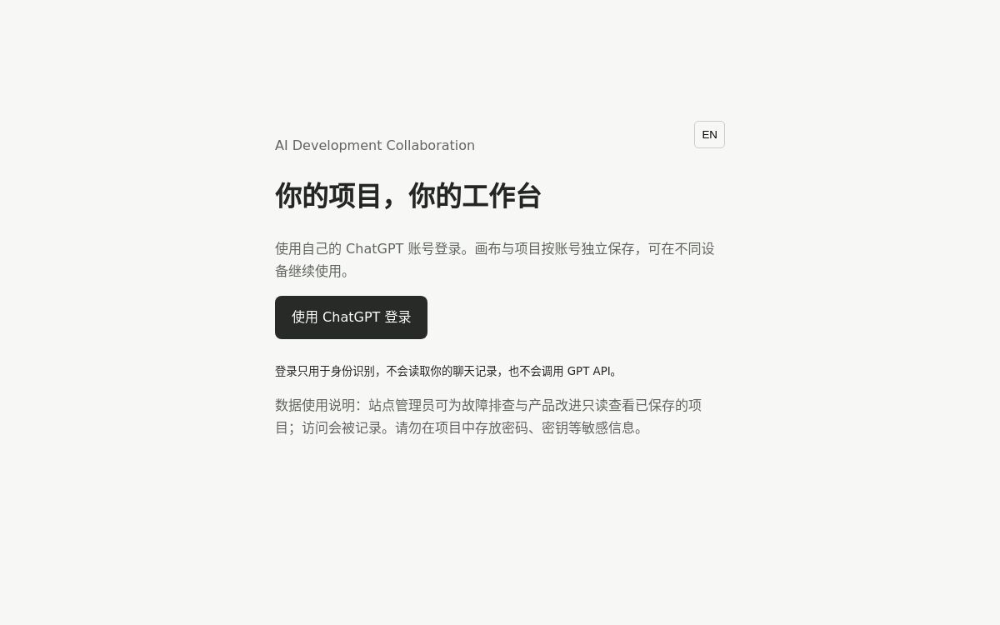

# AI Development Collaboration

[](https://ai-dev-collaboration-workbench.dingikang.chatgpt.site)

一个用于人和 AI 协作开发的可视化工作台。它帮助使用者整理软件、Agent、产品、架构和 design-to-code 项目的当前状态，记录模块、决策、产物与验证证据，并在需要时生成可供开发 Agent 使用的项目资料。

**在线站点：** [立即打开 AI Development Collaboration](https://ai-dev-collaboration-workbench.dingikang.chatgpt.site)

## 站点展示



> 截图展示站点的入口页面。登录后可以进入个人工作台，创建项目并使用画布、方法地图和验证记录。

工作方法包含 Explore → Align → Specify → Decide → Plan → Execute → Verify → Converge → Learn 九个阶段。阶段可以按项目当前情况跳转、回退或并行，不要求每个项目从 Explore 开始。

## 可以做什么

- **项目与阶段：**从当前问题进入合适阶段，查看方法地图，创建和管理项目。
- **项目画布：**用模块和节点组织工作；支持容器/子模块的展开与折叠、拖动、语义缩放、聚焦详情，以及数据流、执行流、依赖/依据关系。
- **决策与验收：**为模块记录 WHY、WHAT、INTENT、产物和验证证据；区分正常、边界、异常、回归场景，保留复验与人工接受记录。
- **开发资料：**预览并下载 Development Pack，供 ChatGPT、Claude Code 或 Codex 等环境继续使用。
- **中英界面：**默认中文，可切换英文；提供响应式布局与减少动画的设置。
- **账号同步：**通过站点的 ChatGPT 登录识别用户；各账号的项目分别保存在站点数据库中，可以跨设备继续使用。
- **管理员排查：**经服务端授权的站点管理员可只读查看已保存的工作区；读取原因和访问记录会留存。

这个站点本身不调用 OpenAI 或其他大模型 API。需要 AI 推理时，仍在使用者自己的 Agent 环境中进行。

## 开始使用

访问上面的在线站点，使用自己的 ChatGPT 账号登录，然后创建项目或打开已有项目。项目会按登录账号保存。如果以前在浏览器中使用过旧版项目，可在“我的账号”中主动导入；旧数据不会自动并入当前账号。

管理员入口是 `/admin`。仅当 Sites 运行时配置了 `SITE_ADMIN_EMAIL`，且该值与当前登录账号的认证邮箱一致时才开放。管理员页面提供总览、按用户 ID 查询、只读查看和访问记录；普通用户无法通过修改前端数据获得管理员权限。

### 保存状态与备份

编辑后会显示“有修改待保存”或“正在保存”，同步成功才显示“已同步到你的账号”。如果网络或服务暂时不可用，修改会保留在当前页面，可以从“我的账号”重试保存或下载整个工作区的 JSON 备份。遇到其他窗口修改造成的版本冲突时，先下载当前备份，再刷新页面，避免覆盖另一个窗口的内容。退出登录会等待正在进行的保存；失败时会停留在当前页面。

下载的工作区备份可以通过“设置 → 导入项目 JSON”恢复项目。导入后各项目会获得新的 ID，因此在恢复前建议先确认账号里已经有哪些项目。

## 本地运行

需要 Node.js 和 npm。仓库已经包含浏览器端文件 `dist/`，可以在本地预览界面：

```bash
git clone https://github.com/Adversit/ai-dev-collaboration-workbench.git
cd ai-dev-collaboration-workbench
npm ci
npm run dev
```

预览服务默认监听 `4173` 端口，打开 `http://localhost:4173`。如需指定端口，可运行 `npm run dev -- --port 3000`。

**本地预览只提供静态界面。** `scripts/preview.mjs` 直接提供 `dist/` 中的文件，不模拟线上 ChatGPT 登录、D1 数据库或服务器 API；涉及登录、云端保存和管理员权限的流程需要在 Sites 托管环境验证。

可运行以下命令检查代码：

```bash
npm test
npm run build
```

`npm run build` 将静态文件和 `server/worker.mjs` 组合成 `dist/server/index.js`，并复制 Sites 部署所需的配置与数据库迁移。构建命令本身不会部署网站。

## 项目结构

| 路径 | 用途 |
| --- | --- |
| `dist/` | 网站的 HTML、CSS、浏览器端 JavaScript；构建时生成的 `dist/server/` 不纳入版本控制 |
| `server/worker.mjs` | 服务端入口逻辑：身份识别、项目存取、管理员只读 API 和静态资源响应 |
| `db/schema.ts`、`drizzle/` | D1 数据表定义与迁移文件 |
| `scripts/preview.mjs` | 本地静态预览 |
| `scripts/build.mjs` | 生成 Sites Worker 部署产物 |
| `tests/` | Node 自动化测试 |
| `docs/` | 设计说明与阶段性验收记录 |
| `.openai/hosting.json` | Sites 项目 ID 与逻辑 D1 绑定配置 |

## 登录、数据与权限

正式站点由 Sites 提供 ChatGPT 登录，并向 Worker 传递已认证用户信息。应用不会收集 ChatGPT 密码或 OAuth token，也不会读取聊天记录。`workspaces` 表按平台用户 ID 保存项目 JSON、修订号和更新时间；写入使用修订号检查，多窗口发生版本冲突时不会静默覆盖另一窗口的数据。

管理员权限在服务端通过认证邮箱与 `SITE_ADMIN_EMAIL` 比对；未配置时默认关闭。管理员只能读取其他用户的项目，不提供修改或删除入口。读取项目详情需要填写原因，访问写入 `admin_reads` 审计表。使用者不应在项目中保存密码或密钥等敏感信息。

站点数据库使用 Sites 托管的 D1，逻辑绑定名是 `DB`；`.env.example` 仅说明管理员邮箱配置，不包含实际邮箱或凭据。部署时还需要由 Sites 提供身份认证、数据库绑定及迁移环境，不能仅靠上传静态文件复现线上账号功能。

## 开发与部署说明

这个仓库是当前站点源码的 GitHub 副本。修改浏览器端资源后，先运行测试与构建，再通过 Sites 的站点发布流程更新正式站点；单纯推送 GitHub 并不会自动更新在线版本。修改数据库结构时同步维护 `db/schema.ts` 与 `drizzle/` 迁移，并在发布前确认迁移已应用。

详细设计见 [`docs/DESIGN.md`](docs/DESIGN.md)。各阶段的检查和已知限制见 [`docs/ACCEPTANCE.md`](docs/ACCEPTANCE.md)、[`docs/CANVAS_ACCOUNT_ACCEPTANCE.md`](docs/CANVAS_ACCOUNT_ACCEPTANCE.md) 与 [`docs/ADMIN_READABILITY_ACCEPTANCE.md`](docs/ADMIN_READABILITY_ACCEPTANCE.md)。其中较早的验收文件记录了当时版本的状态，当前功能以代码和最新记录为准。
